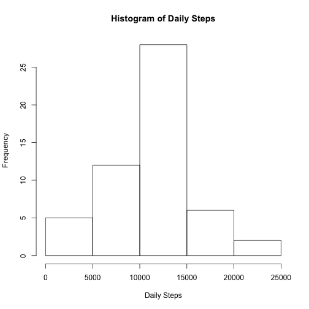
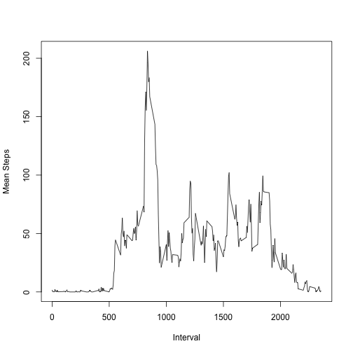
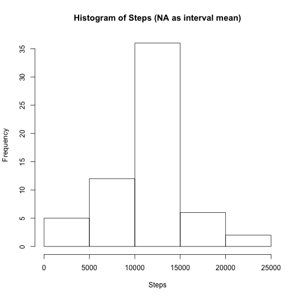
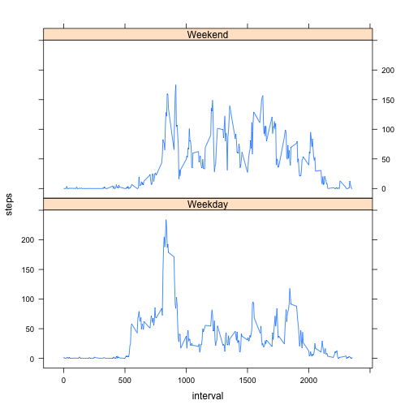

Reproducable Research - Assignment 1
====================

### Loading and Processing the data 

We are first going to read the data into a data frame called "activity"


```r
activity<-read.csv("activity 2.csv", header = TRUE)
```

### What is the total number of steps taken per day? 


```r
dailysteps<-aggregate(activity$steps~activity$date,activity,FUN = sum,na.action = na.omit)
names(dailysteps)<-c("date","steps")
hist(dailysteps$steps,xlab = "Daily Steps", main = "Histogram of Daily Steps")
```



Now to calculate the mean and median number of steps taken per day


```r
meansteps<-round(mean(dailysteps$steps),2)
mediansteps<-median(dailysteps$steps)
meansteps;mediansteps
```

```
## [1] 10766.19
```

```
## [1] 10765
```

The mean number of steps is **1.076619 &times; 10<sup>4</sup>** and the median number is **10765**

### What is the average daily activity pattern? ***


```r
intervalsteps<-aggregate(activity$steps~activity$interval,activity, FUN = mean, na.rm = TRUE)
names(intervalsteps)<-c("interval","mean_steps")
plot(intervalsteps$interval,intervalsteps$mean_steps,type = "l", xlab = "Interval", ylab = "Mean Steps")
```



But which five-minute interval contains the maximum number of steps?


```r
intervalsteps[which.max(intervalsteps[,2]),]
```

```
##     interval mean_steps
## 104      835   206.1698
```

The interval with the most steps is interval **835**, with a mean of **206.17** steps

### Inputting missing values ###

How many missing values are there?


```r
numberNA<-as.character(sum(is.na(activity$steps)))
numberNA
```

```
## [1] "2304"
```

There are **2304** missing values in the dataset. We will estimate these values using the interval mean.


```r
activityna<-activity
for (i in 1:length(activityna$steps)) {
    if (is.na(activityna$steps[i])){
        activityna$steps[i]<-intervalsteps[intervalsteps$interval==activityna$interval[i],2]
    }
}
attach(activityna)
dailystepsna<-aggregate(steps~date,activityna,FUN=sum)
hist(dailystepsna$steps, main="Histogram of Steps (NA as interval mean)", xlab = "Steps")
```



```r
meanstepsna<-mean(dailystepsna$steps)
medianstepsna<-median(dailystepsna$steps)
meanstepsna;medianstepsna
```

```
## [1] 10766.19
```

```
## [1] 10766.19
```

The mean number of steps is **1.0766189 &times; 10<sup>4</sup>** and the median number is **1.0766189 &times; 10<sup>4</sup>**. These values are just a tiny bit higher than previous values, and they seem to minimally impact the mean and median.

### Are there differences in activity patterns between weekdays and weekends?###

The panel plot is as follows:


```r
activity$date<-as.Date(activity$date)
weekend<-ifelse(weekdays(activity$date) %in% c("Saturday","Sunday"),"Weekend","Weekday")
activity<-cbind(activity,weekend)
weekendsteps<-aggregate(activity$steps~activity$interval+activity$weekend,activity, FUN = mean)
names(weekendsteps)<-c("interval","weekend","steps")
library("lattice")
attach(weekendsteps)
```

```
## The following object is masked _by_ .GlobalEnv:
## 
##     weekend
```

```
## The following objects are masked from activityna:
## 
##     interval, steps
```

```r
xyplot(steps~interval|weekend, weekendsteps, type = "l", layout = c(1,2))
```



